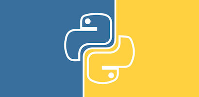

# Programação Orientada a Objetos

A disciplina de Programação Orientada a Objetos do Curso Técnico em Informática Integrado ao Ensino Médio tem como objetivo geral tornar o aluno apto a compreender, projetar, desenvolver e testar softwares utilizando o paradigma de programação orientado a objetos. Sua carga horária apresenta um total de 100 horas/aula e é ministrada pelo professor Diego Pessoa. Para as aulas serão utilizadas exposições e atividades práticas, além de avaliações individuais e em grupo.

## Objetivos específicos
* Compreender os conceitos básicos do paradigma de programação orientado a objetos.
* Conceituar classes, objetos e interação entre objetos.
* Conceituar abstração, encapsulamento, herança e polimorfismo.
* Realizar tratamento de exceções.
* Projetar software orientado a objetos.
* Desenvolver software utilizando uma linguagem de programação orientada a objetos.
* Testar softwares desenvolvidos no paradigma de orientação a objetos.

## Conteúdo
- Unidade 1:
  * Conceitos do paradigma da programação orientada a objetos.
  * Introdução a classes e objetos.
  * Atributos, métodos e interação entre objetos.
  * Sintaxe de linguagem de programação orientada a objetos (Python)
  * O que é abstração em orientação a objetos
  * Encapsulamento
  * Herança e Polimorfismo.
- Unidade 2:
  * Agregação e Composição de objetos.
  * Tratamento de Exceções.
  * Análise e Projeto orientado a objetos.
  * Introdução ao teste de software.
  * Teste de software aplicado ao paradigma de orientação a objetos

Importante: acompanhe o cronograma detalhado da disciplina no [roteiro de aulas](docs/ROTEIRO.md)

## Avaliações

A nota final será computada através da média aritméticas das seguintes atividades:

### 1º Bimestre:
* Avaliação I (Unidade 1) -  [prova](assets/provas/prova-1/poo-avaliacao-1.pdf) -  [respostas](https://github.com/ifpb/intin-poo/tree/master/assets/provas/prova-1/) 
* Atividades em Sala de Aula + [Lista de Exercícios](https://ifpb.github.io/intin-poo/assets/listas/LISTA-01.html)
* [Notas do 1º Bimestre](docs/intin-poo-notas.pdf)

### 2º Bimestre:
* Avaliação II (Unidade 2)
* Projeto I

### 3º Bimestre:
* Avaliação III
* Projeto II

### 4º Bimestre:
* Avaliação IV
* Projeot IV
